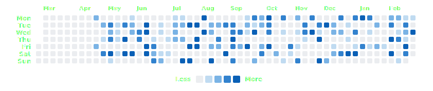

### ⚡ The Data Engine

> "I don't just write code; I build systems that generate data."

**Miguel Ingram** | AI Researcher

You might notice my contribution graph is unusually active. My workflow is defined by **High-Velocity Iteration** (~8,000 commits/year) and **Granular Observability**. I treat my development process as a continuous experiment, where atomic commits drive automated research pipelines.

#### 🛠️ What I'm Building
* **[The Mastery Engine](https://github.com/ImmortalDemonGod/mastery-engine):** A pedagogical operating system that uses **Runtime AST Mutation** and **Shadow Worktrees** to stress-test engineering skills.
* **[Neural Affinity Framework](https://github.com/ImmortalDemonGod/arc-taxonomy-reproduction):** Research proving the "Compositional Gap" in Transformers. Validated against 302+ fine-tuned models.

#### 🧬 The Philosophy
My background is rooted in high-stakes engineering. I started off in the US Navy as a **Nuclear Electronics Technician**, where I developed an obsessive focus on systems reliability and diagnostics. I try to translate that operational rigor into software engineering. My current focus is continuing my research, improving my public outreach and systematically increasing my competitive programming rating. 

#### 🏃 Athletic Training

Running, cycling, and strength training tracked on [Strava](https://www.strava.com). Hover over cells for activity details.

<!-- STRAVA-HEATMAP-START -->

<!-- STRAVA-HEATMAP-END -->

*Automatically updated daily from Strava API*

---
*Open for code audits and architectural consulting.*
---

  

